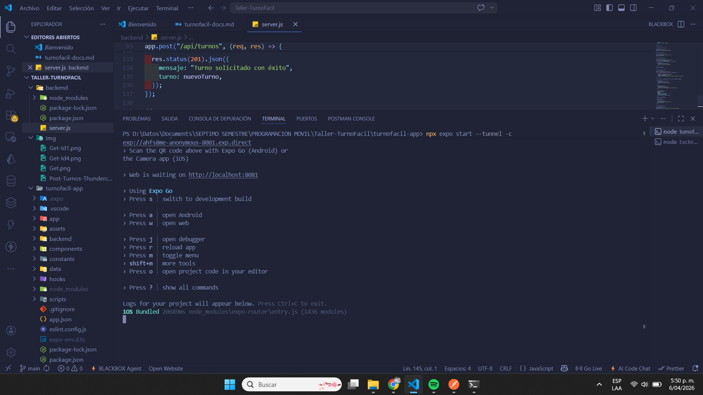
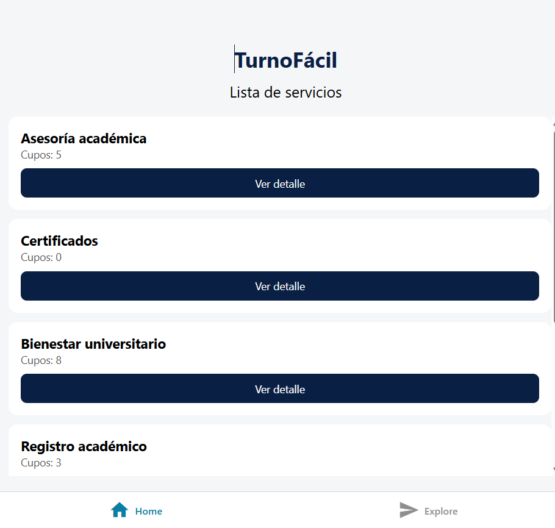
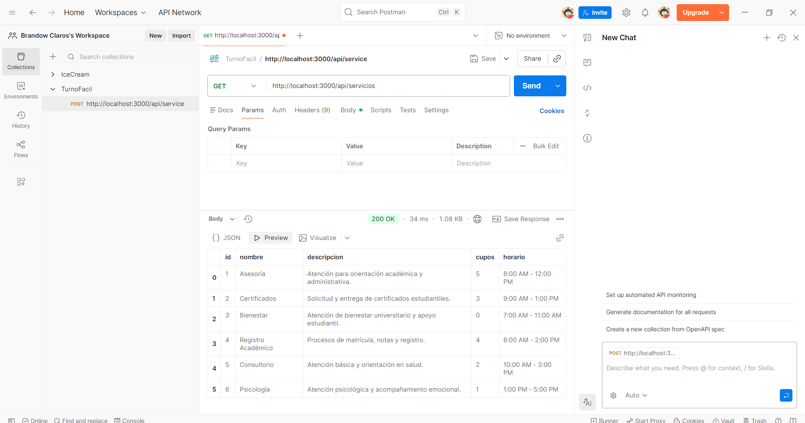
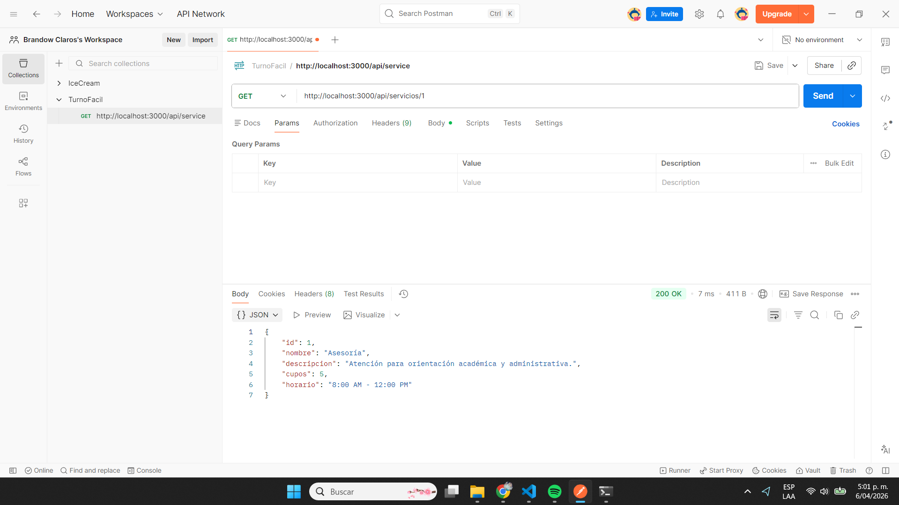
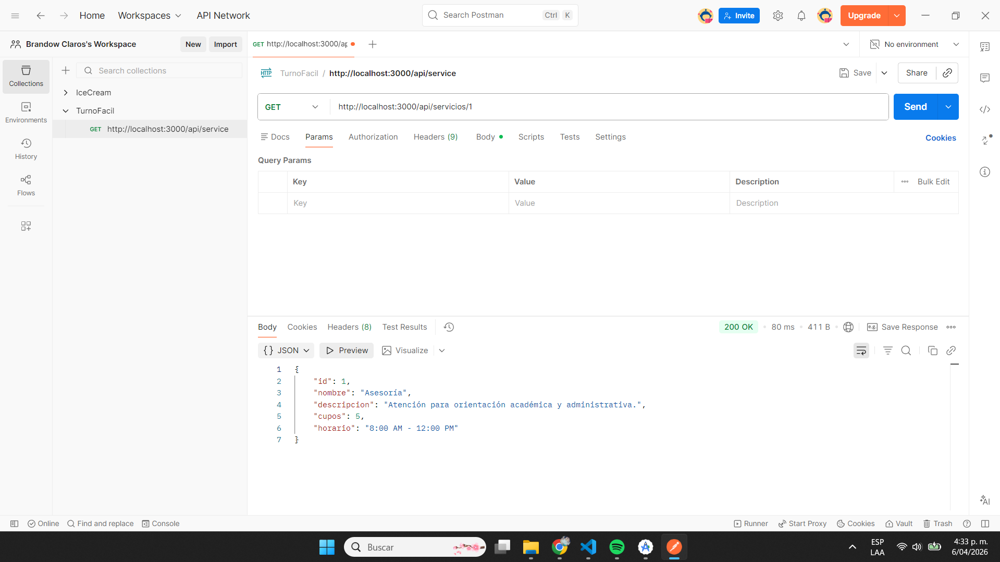
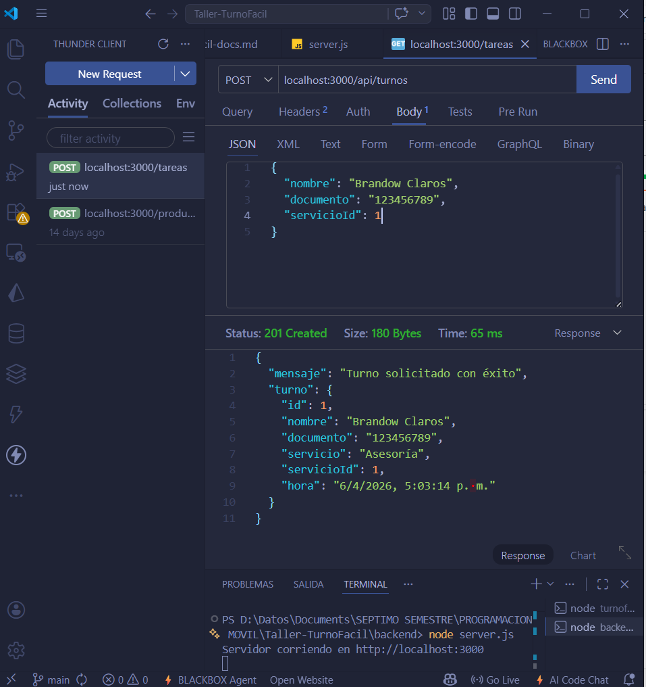

# Taller U2 — TurnoFácil

## Programación Móvil

**Estudiante:** Brandow Claros  
**Asignatura:** Programación Móvil  
**Proyecto:** TurnoFácil  
**Fecha:** 06/04/2026

---

# 1. Introducción

Este taller tiene como propósito el desarrollo de un MVP técnico funcional a partir de un caso real de gestión de turnos. El sistema planteado corresponde a una aplicación móvil llamada **TurnoFácil**, diseñada para permitir a los usuarios visualizar servicios disponibles, consultar el detalle de cada servicio y solicitar turnos de atención.

El desarrollo se realizó utilizando una arquitectura simple compuesta por:

- **Frontend móvil híbrido** desarrollado con **React Native + Expo**
- **Backend mínimo** desarrollado con **Node.js + Express**
- Pruebas funcionales realizadas en **Postman**
- Ejecución en dispositivo móvil real mediante **Expo Go**

---

# 2. Caso de estudio

## App: TurnoFácil

En una oficina como bienestar universitario, secretaría académica o consultorio, la gestión de turnos se realiza manualmente o en papel.

Se propone una aplicación móvil simple que permita:

- Ver una lista de servicios disponibles
- Consultar el detalle de cada servicio
- Solicitar un turno
- Confirmar el registro realizado

---

# 3. Flujo mínimo del MVP

El flujo implementado para el MVP es el siguiente:

```text
Lista de servicios → Detalle del servicio → Solicitar turno → Confirmación
```

---

# 4. Ruta técnica elegida

## Ruta seleccionada:

### **Híbrido — React Native con Expo**

### Justificación

Se eligió la ruta híbrida utilizando **React Native con Expo** por las siguientes razones:

1. **Permite desarrollar aplicaciones móviles de forma más rápida y sencilla**, facilitando la navegación entre pantallas y la ejecución en dispositivos reales sin necesidad de una configuración nativa compleja.

2. **Expo simplifica el proceso de pruebas móviles**, ya que permite visualizar la aplicación directamente en el celular mediante QR con la app **Expo Go**, sin requerir compilaciones avanzadas en esta etapa del MVP.

---

# 5. Herramientas y tecnologías utilizadas

Durante el desarrollo del proyecto se utilizaron las siguientes herramientas:

## Frontend móvil

- React Native
- Expo
- Expo Router
- TypeScript / JavaScript

## Backend

- Node.js
- Express
- CORS

## Pruebas y ejecución

- Postman
- Visual Studio Code
- iPhone con Expo Go

---

# 6. Configuración del entorno

## 6.1 Requisitos previos

Antes de ejecutar el proyecto, fue necesario contar con lo siguiente instalado:

- Node.js
- npm
- Visual Studio Code
- Expo Go en el dispositivo móvil
- Postman

---

## 6.2 Verificación de versiones

Se verificaron las versiones instaladas en el entorno con los siguientes comandos:

```bash
node -v
npm -v
```

### Resultado obtenido:

```bash
Node.js v22.20.0
npm 11.8.0
```

---

## 6.3 Estructura general del proyecto

El proyecto quedó organizado de la siguiente manera:

```bash
App-TurnoFacil-Movil/
├── turnofacil-app/    # Aplicación móvil
└── backend/           # API REST
```

---

# 7. Configuración y ejecución del frontend móvil

## 7.1 Ubicación en la carpeta del proyecto

```bash
cd turnofacil-app
```

---

## 7.2 Instalación de dependencias

Se instalaron las dependencias del proyecto con el siguiente comando:

```bash
npm install
```

---

## 7.3 Verificación de Expo

Se verificó la instalación de Expo con:

```bash
npx expo --version
```

### Resultado obtenido:

```bash
54.0.23
```

---

## 7.4 Ejecución del proyecto móvil

Para iniciar el proyecto se utilizó el comando:

```bash
npm run start
```

Posteriormente, debido a un problema de carga visual en el dispositivo móvil, se ejecutó la aplicación con limpieza de caché y conexión tipo túnel:

```bash
npx expo start --tunnel -c
```

Esto permitió una carga más estable del proyecto en el celular.

---

## 7.5 Prueba en dispositivo móvil real

La aplicación fue probada en un **iPhone** utilizando la app **Expo Go**, escaneando el código QR generado por Expo.

Esto permitió validar que la aplicación sí puede ejecutarse como app móvil real y no únicamente en navegador.

---

## Evidencia 1 — Entorno / SDK / emulador o dispositivo configurado



---

## Evidencia 2 — App corriendo en dispositivo móvil



---

# 8. Implementación del MVP

La aplicación desarrollada implementa las 3 pantallas obligatorias solicitadas en el taller.

---

## 8.1 Pantalla 1 — Lista de servicios

Esta pantalla permite visualizar los servicios disponibles para solicitar atención.

### Servicios incluidos:

- Asesoría
- Certificados
- Bienestar
- Registro Académico
- Consultorio
- Psicología

---

### Evidencia — Pantalla Lista de Servicios



---

## 8.2 Pantalla 2 — Detalle del servicio

Esta pantalla muestra la información detallada del servicio seleccionado.

### Datos mínimos mostrados:

- Nombre
- Descripción
- Cupos disponibles
- Horario

---

## 8.3 Pantalla 3 — Solicitar turno

Esta pantalla contiene el formulario para registrar un turno.

### Campos mínimos del formulario:

- Nombre
- Documento / código
- Servicio
- Hora (generada automáticamente o registrada)

Además, se incluye un botón para confirmar la solicitud.

---

---

# 9. Regla funcional implementada

Se implementó la siguiente regla de negocio mínima:

## Regla:

Si un servicio tiene:

```text
cupos = 0
```

entonces:

- se muestra el mensaje **“Sin cupos”**
- se bloquea la posibilidad de solicitar turno

Esta validación fue considerada tanto en la lógica visual del frontend como en la validación del backend.

---

# 10. Configuración y desarrollo del backend

## 10.1 Creación de la carpeta backend

Desde la carpeta principal del proyecto se creó la carpeta:

```bash
backend
```

Y luego se ingresó a ella:

```bash
cd backend
```

---

## 10.2 Inicialización del proyecto Node.js

Se creó el archivo `package.json` con:

```bash
npm init -y
```

---

## 10.3 Instalación de dependencias

Se instalaron las librerías necesarias:

```bash
npm install express cors
```

---

## 10.4 Archivo principal del backend

Se creó el archivo:

```bash
server.js
```

En este archivo se desarrolló la API REST mínima requerida para el taller.

---

# 11. Endpoints implementados

Se implementaron los siguientes endpoints obligatorios:

---

## 11.1 GET /api/servicios

Permite obtener la lista completa de servicios disponibles.

### Ruta:

```http
GET /api/servicios
```

### Ejemplo:

```http
http://localhost:3000/api/servicios
```

## 

## 11.2 GET /api/servicios/:id

Permite obtener el detalle de un servicio específico.

### Ruta:

```http
GET /api/servicios/:id
```

### Ejemplo:

```http
http://localhost:3000/api/servicios/1
```



## 

## 11.3 POST /api/turnos

Permite registrar un nuevo turno.

### Ruta:

```http
POST /api/turnos
```

### Ejemplo:

```http
http://localhost:3000/api/turnos
```

### Body de ejemplo:

```json
{
  "nombre": "Brandow Claros",
  "documento": "123456789",
  "servicioId": 1
}
```



---

# 12. Validaciones implementadas en el backend

Se implementaron las siguientes validaciones mínimas:

---

## 12.1 Validación de campos requeridos

Si faltan datos obligatorios como:

- nombre
- documento
- servicioId

El backend responde con:

```http
400 Bad Request
```

---

## 12.2 Validación de servicio inexistente

Si se intenta solicitar un turno para un servicio que no existe, el backend responde con:

```http
404 Not Found
```

---

## 12.3 Validación de cupos disponibles

Si un servicio no tiene cupos disponibles, no se permite registrar el turno.

---

# 13. Ejecución del backend

Para iniciar el backend se utilizó el siguiente comando:

```bash
node server.js
```

### Resultado esperado:

```bash
Servidor corriendo en http://localhost:3000
```

---

# 15. Video del flujo funcional del MVP

Se realizó un video corto mostrando el flujo completo de la aplicación:

```text
Lista de servicios → Detalle → Solicitar turno → Confirmación
```

---

## Evidencia — Video del flujo del MVP

https://drive.google.com/file/d/1jrtwWgKU749Yntdmj-izJAx02LlnCzq4/view?usp=sharing

---

# 16. Dificultades presentadas y solución aplicada

Durante el desarrollo del proyecto se presentaron algunas dificultades técnicas, principalmente relacionadas con la ejecución del frontend móvil y la conexión entre el entorno local y el dispositivo físico.

## Dificultades identificadas:

- Error inicial de reconocimiento de Expo
- Problemas de instalación de dependencias
- Fallo de carga visual al abrir la app en el iPhone
- Necesidad de limpiar caché del proyecto

## Solución aplicada:

Se solucionó ejecutando el proyecto con el siguiente comando:

```bash
npx expo start --tunnel -c
```

Esto permitió:

- limpiar la caché de Expo
- mejorar la conectividad con el dispositivo móvil
- ejecutar correctamente la app en Expo Go

---

# 17. Conclusión

El desarrollo del MVP **TurnoFácil** permitió implementar una solución funcional de gestión de turnos a partir de un caso de uso real. Se logró construir una aplicación móvil con navegación básica, validaciones mínimas y un backend sencillo capaz de simular información real mediante una API REST.

Además, se comprobó la ejecución del sistema en un dispositivo móvil real, lo cual fortalece el cumplimiento del enfoque práctico del taller y evidencia la transición desde el diseño del flujo hasta su implementación funcional.

---

# 18. Enlaces del proyecto

https://github.com/BrandowC/App-TurnoFacil-Movil

---

# 19. Anexos

## 19.1 Capturas pendientes

- Entorno configurado
- App corriendo
- Lista de servicios
- Detalle del servicio
- Solicitar turno
- Postman GET servicios
- Postman GET detalle
- Postman POST turno

---
